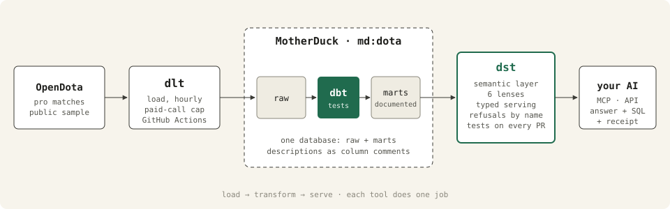

# dota-data-stack

Dota 2 match data, from OpenDota's API to a governed answer in your own AI. Four tools,
each doing one job: **dlt** loads, **dbt** transforms, **MotherDuck** holds it, and
**dst (data serve tool)** serves it to Claude, ChatGPT or any MCP client, with the SQL and
a receipt on every answer.



On 26 September 2026 the warehouse held a full year of OpenDota's professional feed,
22,896 matches back to 26 September 2025, each with its complete detail: every pick and
ban, every objective, the per-minute gold and experience curves, the item purchases, and
what happened inside the match (teamfights, with the damage, wards, runes and buybacks
around them). The pro lenses count the 9,269 of those matches played in leagues OpenDota
rates premium or professional: 92,690 player rows, 58,454 teamfights, 4.2 million item
purchases. Tier-3 leagues, which OpenDota rates excluded, stay in the raw tables. Next to
them sit 52,263 public matchmaking games with their rank bracket. A scheduled job adds
whatever is new every four hours.

## Ask it

Real questions against the live warehouse, answered by the lenses in `serve/` on dst
0.6.0, verbatim except where cut with `…`.

**A typed answer.** Every slot of the query (metric, filters, bracket) was picked from the
declared semantic layer, so the SQL is compiled, not written by a model.

```
pub_meta › What is Anti-Mage's win rate at Divine?

Anti-Mage's win rate in the Divine bracket is 48.9% (per the hero_win_rate definition:
wins ÷ games, shown only where games ≥ 20). This covers ranked All Pick only, from a
sample of public matchmaking games (the newest matches OpenDota lists at each load); Turbo
and unranked games are excluded.

status ok · typed · tag declared · confidence verified · data as of 2026-09-26
SELECT CASE WHEN (SUM(pub_hero_stats.games)) >= 20
            THEN (SUM(pub_hero_stats.wins)) * 1.0 / NULLIF((SUM(pub_hero_stats.games)), 0)
       END AS hero_win_rate
FROM marts.pub_hero_stats AS pub_hero_stats
WHERE pub_hero_stats.bracket_name = 'Divine' AND pub_hero_stats.hero_name = 'Anti-Mage'
  AND (pub_hero_stats.game_type = 'ranked_all_pick')
```

Two lines of that SQL are not in the question. The table declares its population, so every
query over it carries the `game_type` filter, and the metric carries its own games floor,
so a rate over a handful of games comes back empty instead of topping a ranking.

**A ranking over a governed term.** "The current patch" is a declared fact from the
patches table, not a guess from match dates.

```
drafts › Which hero is contested most on the current patch?

Puck is contested most on the current patch, with 2,068 contests … This covers only
Captains Mode professional matches in leagues OpenDota rates premium or professional whose
draft OpenDota recorded, so it does not represent all matches.

status ok · typed · tag declared · confidence verified · data as of 2026-09-26
```

**A certified answer.** The question matched one a person approved, so the approved SQL
ran as written.

```
pro_meta › How often does the side that kills Roshan first win on the current patch?

On the current patch, the side that takes the first Roshan wins 75.7% of the time … This
covers professional matches only (leagues OpenDota rates premium or professional, within
the loaded window), and only matches in which a side actually took that objective.

status ok · typed · tag certified · confidence verified · data as of 2026-09-26
```

**The team grain.** A team's record is counted on a table with one row per team per match,
not on the player rows, where every match appears five times.

```
pro_meta › How many matches did Team Spirit play?

Team Spirit played 275 matches, counting only both sides of professional matches in the
loaded window in leagues OpenDota rates premium or professional …

status ok · typed · tag declared · confidence verified · data as of 2026-09-26
SELECT COUNT(team_matches.match_id) AS matches_played
FROM marts.fact_team_match AS team_matches
WHERE team_matches.team_name = 'Team Spirit'
```

**A concept with no column.** "Wins the lane" is a governed term (400 gold ahead at minute
10, laners matched by map lane), "offlaner" maps to a stored position, and the answer
carries the rule, the filter and the games floor.

```
playstyle › Which offlaners absorb the most damage from enemy heroes per minute?

Among offlane heroes meeting the 10-game threshold … Wraith King leads at 886.1, followed
by Undying (847), Ogre Magi (808.1), Timbersaw (732.1) and Tiny (726.2) … These figures
cover only Player-games in parsed professional matches in leagues OpenDota rates premium
or professional …

status ok · typed · tag declared · confidence verified · data as of 2026-09-26
```

**A question that does not type, answered and disclosed.** Two counts side by side for
one hero is a shape the typed path does not build, so the lens falls back to model-written
SQL and says so on the answer.

```
drafts › Is Pangolier picked or banned more?

For Pangolier, bans outnumber picks: 1,780 bans versus 1,382 picks. This covers only
Captains Mode professional matches in leagues OpenDota rates premium or professional whose
draft OpenDota recorded.

status ok · untyped · confidence partial · data as of 2026-09-26
UNTYPED: served by raw-SQL generation — the question did not type: Ranked by which end —
highest or lowest first?
```

**Refusals.** The public sample is ranked All Pick only, and the pro lenses leave out
tier-3 leagues. A question about either is refused before any query runs, with the reason,
instead of returning an empty ranking or a blended one.

```
pub_meta › What is the best hero in Turbo?

I can't answer this from this lens's data: Turbo hero data is outside this model's scope —
every public-sample table is governed to ranked All Pick only (required filter game_type =
'ranked_all_pick'; the population text states Turbo and unranked games are excluded) …

status refused
```

```
pro_meta › How did teams do in Destiny League?

this lens cannot compute tier-3 leagues — professional matches here are those in leagues
OpenDota rates premium or professional; matches in leagues it rates excluded, its tier-3
leagues such as Destiny League, Dota 2 Space League and Ultras Dota Pro League 2025-26,
stay in the raw tables and reach no table in this lens …

status refused
```

## The four layers

**dlt** (`load/opendota_pipeline.py`) pulls the pro-match list, one detail record per
match with its purchase log, the newest public matchmaking games with their rank tier, and
the dimension tables: heroes, items, patches, patch notes, leagues, teams, pro players.
Rows merge on their keys, so a re-run changes nothing it already loaded. Only the
match-detail calls need an OpenDota key. Before buying details, each run reads which
matches the warehouse already holds and skips them; every paid call is counted in an
`api_usage` table and a monthly ceiling (`DOTA_PAID_CALLS_MONTH`) stops the run when
reached. List calls stay on the free tier and stop at the first page the warehouse already
holds, so a routine run pays for new matches only. If OpenDota is down, a run loads what it
fetched, leaves the dimension tables as they were, and fails. The scheduled run is a
Cloud Run job (`deploy/loader/`); `.github/workflows/load.yml` does the same load and
transform on demand.

**dbt** (`transform/`) turns the raw tables into 22 staging views and 50 marts, in five
areas:

Every pro model reads the same matches: one filter in `stg_leagues` keeps the leagues
OpenDota rates premium or professional, and a test fails if a tier-3 match reaches a pro
mart.

- **Matches and heroes**: one row per pro match, one per team per match, one per player per
  match with a derived position, heroes per patch and per position, patch-over-patch
  trends, team head-to-head, league standings, patch notes; and over the public sample,
  hero stats by rank bracket, matchups, duos, daily trends, and win rate by game length.
- **Itemization** (`marts/items/`): a major-item definition (a completed item of at least
  2,000 gold, or one with its own active), the first, second and third major item per hero
  with their timings, win rate by purchase-minute window, starting items and whole starting
  builds, and end-of-game inventories with neutral items by tier.
- **Drafts** (`marts/drafts/`): every pick and ban with its draft phase, per-hero first-pick,
  last-pick and contest rates, pro hero-versus-hero draft matchups, lane partners, team
  lineups and signature heroes.
- **Timings** (`marts/timings/`): the gold and experience lead per minute, the lead at 10,
  15, 20 and 25 minutes, comebacks from 10,000 gold behind, and first blood, first tower
  and first Roshan with how often the side that took them won.
- **Behaviour** (`marts/behaviour/`): how a match was played. Teamfight participation from
  OpenDota's fight windows, farm priority as each player's share of the side's gold at 10
  and 20 minutes, lane outcomes at minute 10 matched by map lane, a declared proxy for
  space created (damage absorbed from enemy heroes, and deaths traded for a tower or
  Roshan, kept as two numbers), wards, runes and buybacks, rolled up per hero and
  position and per player, by patch.

252 tests pin the grains, every fact-to-dimension reference, the league tier, the draft
shape and the behaviour sums, and three unit tests pin the position derivation, the
400-gold lane band and the reading of a league's final on fixed inputs. Every model and all 844 mart columns are documented,
and `persist_docs` writes those descriptions into the warehouse as comments.
Match dates are the UTC date, pinned in SQL, whoever runs dbt.

**MotherDuck** holds both the raw tables and the marts in one database, `md:dota`. dlt and
dbt write with a read-write token; dst reads through its own connection, opened read-only,
so nothing served can write. Switching dlt and dbt between MotherDuck, a local DuckDB
file and Postgres is one variable, `DSTACK_TARGET`; dst's side is the `warehouse` block in
`serve/dst.yaml`.

**dst** (`serve/`) declares what the marts mean: 47 entities with their metrics, the 103
joins between them, 36 governed terms (bracket, position, major item, first pick, counter,
comeback, lane outcome, farm share, fight participation, space created as a declared
proxy, the current patch, the minimum-games rule), what each lens must refuse (MMR, prize
money, personal match history, items in pubs, tier-3 leagues, what players said or
intended), and which
end of a metric is the better one. Six lenses, each the one home for its kind of question:

| lens | answers |
|---|---|
| `pro_meta` | professional matches: heroes per patch and position, teams, leagues, gold leads, comebacks, objectives |
| `pro_players` | the players in them: who plays what, how well, for which team |
| `drafts` | picks and bans, draft phases, contested heroes, draft counters, lineups |
| `items` | item builds, core items, timings, starting items, neutral items |
| `playstyle` | how pros play: fights, farm priority, lane outcomes, space, vision and runes, by hero, position and player |
| `pub_meta` | the public sample: heroes by rank bracket, counters, duos, trends |

Answers are typed first, compiled from the declared layer, and fall back to disclosed
model-written SQL only when a question cannot be typed.
`dst probe` reads the warehouse's own column descriptions, value lists for the declared
dimensions (127 heroes, every team), and each table's freshness.

## Tests on every pull request

`.github/workflows/dst-test.yml` runs on every pull request that touches `serve/` or
`transform/`: it starts a throwaway dst server, applies the semantic layer, and runs
every lens's test suite against the live warehouse (161 checks across the six lenses).
What an enthusiast asks must answer;
what the data cannot carry must refuse by name. A failing case fails the pull request, and
an empty suite fails it too, since a suite that ran nothing proved nothing.

## Run it yourself

```
cp .env.example .env              # MotherDuck token, or DSTACK_TARGET=duckdb for a local file
uv sync
make load                         # keyless works: 3,000 calls a day; a key speeds up match details
make transform
```

To serve, dst needs a Postgres of its own for its state and a model. Fill
`DST_API_KEY_DEEPSEEK` and `DST_API_KEY_JEV` in `serve/.env` (or change the providers in
`serve/dst.yaml`), then:

```
pip install 'dst-core[local-embed]'
cd serve && dst dev               # Postgres up + migrate + serve
dst bootstrap --org dota          # once: an org and an admin token, saved to .env
dst probe                         # column descriptions, value lists, freshness
dst apply                         # entities, joins, terms, lenses; runs the eval gate
dst query pro_meta "Which hero was banned most on the current patch?"
dst test pub_meta
```

`dst apply` probes the warehouse before anything lands and blocks a lens whose test
suite got worse than the version it would replace.

## Where the governed layer earns its keep

The data has the traps a semantic layer exists for. "Win rate" needs a denominator: a
hero's games, a team's matches, or the Radiant side of every match, and the terms in
`serve/semantic/definitions/` say which. A team's record counted on player rows comes out
five times too many matches, so team questions read a table with one row per team per
match. "The current patch" is a declared fact from the patches table, not a guess from
match dates. More than half of OpenDota's pro feed is tier-3 leagues, which would decide
every "pro meta" answer if they blended in, so the pro lenses count premium and
professional leagues only and say so. The public numbers come from a sample, and every
answer over them says so. A rate over three games is noise, so every rate metric carries
its games floor inside the SQL (20 games for a hero or a team, 10 for a position or a
player). Turbo is a different game and never blends into the ranked meta. Pro matches
carry no MMR and no prize money, and the public feed carries no items and no player
identities, so each lens refuses those questions instead of approximating them. "Space"
has no column anywhere, so the playstyle lens declares a proxy in two parts, never adds
them, and says so on every answer. Each of those is a file in `serve/` or `transform/`, and
each is a place where the answer would otherwise have been plausible and wrong.

## Layout

```
load/opendota_pipeline.py        dlt: OpenDota → raw
transform/                       dbt: raw → staging → marts, documented and tested
serve/                           dst: dst.yaml, semantic/, lenses/, profiles/
.github/workflows/load.yml       load + transform on demand
deploy/loader/                   the scheduled load, a Cloud Run job
.github/workflows/dst-test.yml   dst tests on every pull request
docs/architecture.svg            the diagram above
```

Data from [OpenDota](https://www.opendota.com/), under their API terms.
